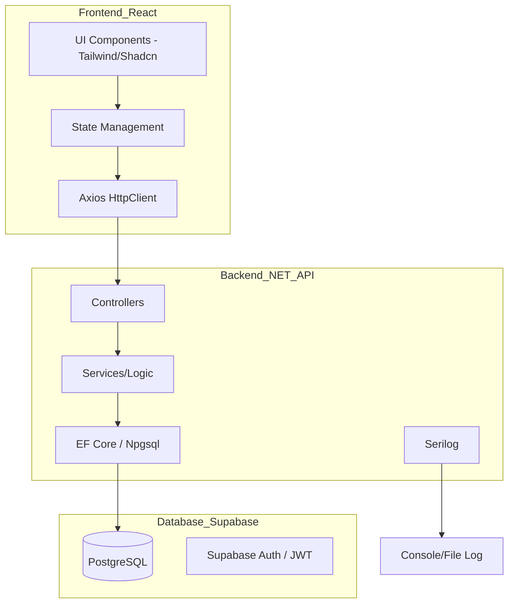

# Migration and Improvement Plan: Smart Repair App

This document outlines the strategy to migrate the Smart Repair application from SQL Server/Azure to PostgreSQL/Supabase, modernize the UI, and expand its features.

## 1. Backend Migration (SQL Server to PostgreSQL)

### Why Supabase?
Supabase provides a managed PostgreSQL database with a generous free tier, which is perfect for a portfolio project.

### Steps:
1.  **Package Update**: Replace `Microsoft.EntityFrameworkCore.SqlServer` with `Npgsql.EntityFrameworkCore.PostgreSQL`.
2.  **Configuration**: Update [`Program.cs`](../smart-repair-api/Program.cs) to use `.UseNpgsql()` instead of `.UseSqlServer()`.
3.  **Migrations**: PostgreSQL and SQL Server have different types and constraints. We will delete the `Migrations/` folder and create a fresh initial migration.
4.  **Data Seeding**: Ensure [`DbSeeder.cs`](../smart-repair-api/Data/Seed/DbSeeder.cs) uses standard EF Core methods that are provider-agnostic.

## 2. Frontend Modernization

### Tech Stack:
- **Tailwind CSS**: For rapid, responsive styling.
- **Lucide React**: For modern, clean icons.
- **Component Library**: I suggest using **Shadcn UI** (built on Radix UI) for high-quality, accessible components like Modals, Tables, and Forms.

### Improvements:
- **Responsive Design**: Move away from fixed widths to a mobile-first grid/flexbox layout.
- **Better UX**: Add loading states (skeletons), toast notifications for actions, and empty state illustrations.

## 3. Feature Expansion

### CRUD Operations:
- Complete the `Create`, `Update`, and `Delete` logic in both the API controllers and the React services.
- Add validation on both ends (FluentValidation in .NET, Zod or simple state validation in React).

### Authentication:
- **Option A (Supabase Auth)**: Very easy to set up, handles JWTs, and integrates directly with the DB.
- **Option B (ASP.NET Core Identity)**: More "standard" for .NET developers, gives you full control over the auth logic.
- *Recommendation*: Since we are using Supabase for the DB, using their Auth is very efficient, but for a .NET portfolio, implementing **JWT Auth with ASP.NET Core Identity** might show more "under the hood" knowledge.

### Logging:
- **Serilog**: Highly recommended. It allows you to log to the console, files, or even external services (like Seq or Application Insights). It's a standard in the .NET ecosystem.

## 4. Database Schema Expansion
To make the project more "Senior-looking", we can add:
- **User/Technician**: Who is assigned to the repair?
- **Repair History/Notes**: A one-to-many relationship to track progress.
- **Categories/Status**: Lookup tables or Enums for better data organization.

---

### Mermaid Diagram: System Architecture

